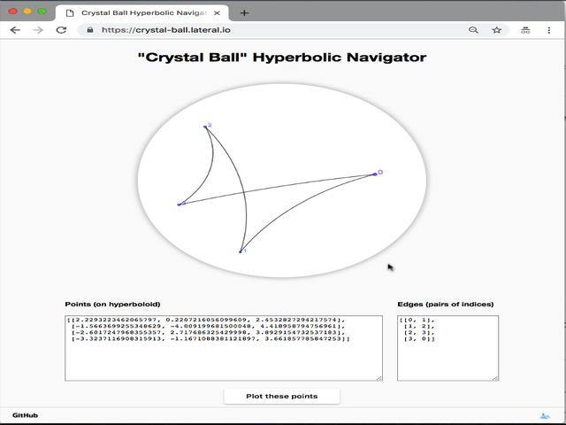

# Hyperbolic Crystal Ball (a.k.a. hyperbolic fish-eye)
A "crystal ball" for viewing graphs (or just point configurations) in 2-dimensional hyperbolic space, using the Poincaré disc model.  Edges are drawn as geodesic arcs.
All computation is performed client-side, in JavaScript.

## Uses
+ Learning about hyperbolic geometry and the Poincaré disc model.
+ Inspecting 2-dimensional hyperbolic embeddings resulting from machine learning algorithms (this was the motivation of the author).
+ Rotating and translating point configurations for better presentation (just paste your points in, transform as desired, and copy them back out again).

## Requirements
There are no external software dependencies.  Your web browser needs to be able to render HTML5 (all modern browsers can do this) and have JavaScript enabled (it usually is, by default).

## Installation and usage
Simply download or close the repository and open `index.html` in your web browser (e.g. via `File > Open File ...`).

### Hosted version
Alternatively, a hosted version is available [here](https://crystal-ball.lateral.io/).

## Functionality
+ The entire graph or point configuration can be translated or rotated by dragging the ambient. 
+ Individual points can be moved by clicking and dragging.  Movements always follow geodesic arcs (the one that is tangent to the displacement induced by the drag).  Edges are attached to the points, so they follow any changes. 
+ Point and edge configurations can be loaded by simply pasting them into the textareas and hitting the "update" button.  Either hyperboloid or Poincaré disc coordinates can be used. 

### Limitations
+ As all computation is in client-side JavaScript, performance may be poor for large graphs.
+ Numerical stability is lower when points are further away from the centre of the Poincaré disc.

## Development

### Tests
Unit testing is performed using [QUnit](https://qunitjs.com/) and [qunit-assert-close](https://github.com/JamesMGreene/qunit-assert-close) (both bundled). To run the unit tests in your browser, open `run_tests.html`.  Opening this page runs the tests in your browser.

### Contributing
Pull requests are encouraged!

### Support and bug tracking
Please open an issue on the [GitHub repository](https://github.com/lateral/crystal-ball).

## Related work
+ David Madore's fantastic [hyperbolic maze](http://www.madore.org/~david/math/hyperbolic-maze.html), using a periodic tiling of a quotient of the hyperbolic plane.  Navigation through the maze via the Poincaré disc model, uses the same mathematics.
+ The very impressive [hyperbolic cellular automaton simulator](https://dmishin.github.io/hyperbolic-ca-simulator/help.html) has related functionality for exploring the Poincaré disc, though for quite a different purpose.
+ Related software is reported to have been developed at the [University of Bielefeld](https://www.techfak.uni-bielefeld.de/~walter/h2vis/), but no implementation seems to be available.
+ There is a video of a very impressive [3D graph explorer](http://graphics.stanford.edu/papers/h3/) using the Poincaré ball, from Tamara Munzer (1998).  No implementation seems to be available. 
